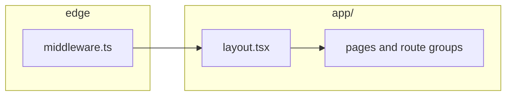
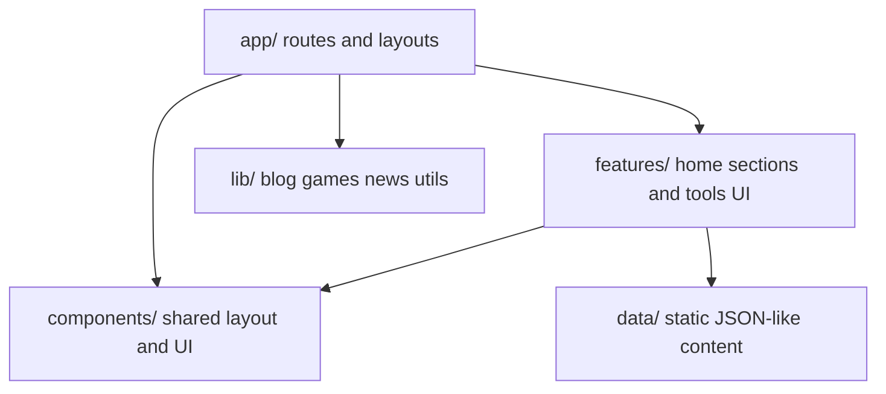

# Architecture overview

High-level map for humans and AI. Update when you add major routes or data sources.

## Stack

- **Framework**: Next.js 15 (App Router), React 18
- **Styling**: Tailwind CSS, `@tailwindcss/typography` for prose
- **Content**: Static data in `data/`; blog posts loaded via `lib/githubBlog.ts`
- **Theme**: `next-themes` via `components/providers/theme-provider.tsx`

## Request / page flow (simplified)

- **middleware**: www → apex redirect only; does not auth-gate routes.

## Folder responsibilities

| Directory | Role |
|-----------|------|
| `app/` | File-system routes: `/`, `/blog`, `/news`, `/projects`, `/tools`, `/games`, error boundaries, loading UI |
| `features/` | Composable sections: Hero, About, Projects, Experience, Skills, Contact, tool widgets |
| `components/` | Header, footer, ads, blog UI, reusable `ui/` primitives |
| `data/` | Projects, experience, skills, tool/game page copy |
| `lib/` | GitHub blog fetch, game helpers, shared utilities |
| `types/` | Shared TypeScript types (e.g. blog) |
| `constants/` | Site URL, SEO, AdSense config |

## Cross-cutting concerns

- **Ads**: `AdSenseScript`, `AdUnit`, `AdBanner` — config driven from `constants`.
- **Blog**: Rendering uses `MarkdownRenderer` and related blog components under `components/`.

## Diagrams in this file

Diagrams use **Mermaid**. In VS Code/Cursor, install **Markdown Preview Mermaid Support** (`bierner.markdown-mermaid`) for preview, or paste sections into any Mermaid-compatible viewer.
